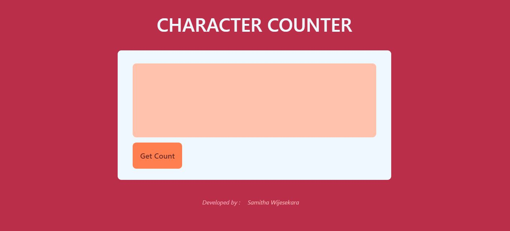
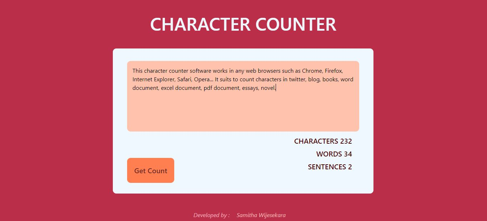

# Character-Counter-with-JS
This application is suits to count characters, words and sentences in a paragraph.

### Table of Content
-01 [What is this?](#What) 
-02 [What are the technologies used?](#technologies) 
-03 [How to used this?](#How) 

## What is this?<a name="What"/>
This is a simple web app for count characters, words and sentences in a paragraph.

## What are the technologies used?<a name="technologies"/>
- HTML
- CSS
- JavaScript

## How to use this?<a name="How"/>
Just paste your paragraph in to text area and click the **Get Count** button. Then you can get number of characters, words and sentences in your paragraph.

